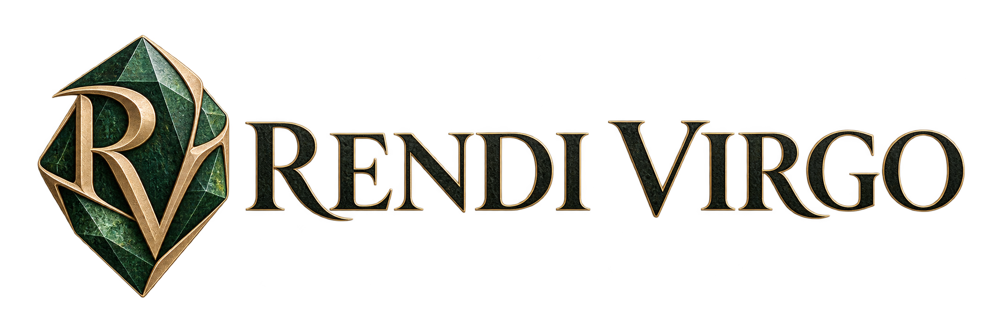

# Dokumen Perencanaan Proyek
## RENDI VIRGO — Online Store (rendivirgo.com)

| | |
|---|---|
| **Nama Proyek** | RENDI VIRGO Online Store |
| **Domain** | rendivirgo.com |
| **Jenis Bisnis** | E-commerce — Penjualan Batu Semi Mulia (Semi Precious Stones) asal Indonesia |
| **Versi Dokumen** | 1.0 |
| **Tanggal** | 21 September 2026 |
| **Status** | Draft Perencanaan |

---

## Daftar Isi

1. [Ringkasan Eksekutif](#1-ringkasan-eksekutif)
2. [Latar Belakang & Tujuan Bisnis](#2-latar-belakang--tujuan-bisnis)
3. [Target Audiens & Persona Pengguna](#3-target-audiens--persona-pengguna)
4. [Ruang Lingkup Produk](#4-ruang-lingkup-produk)
5. [Struktur Informasi & Sitemap](#5-struktur-informasi--sitemap)
6. [Spesifikasi Halaman](#6-spesifikasi-halaman)
7. [Skema Data Produk](#7-skema-data-produk)
8. [Fitur Fungsional](#8-fitur-fungsional)
9. [Dashboard Admin](#9-dashboard-admin)
10. [Arsitektur Teknis](#10-arsitektur-teknis)
11. [Desain UI/UX & Branding](#11-desain-uiux--branding)
12. [SEO & Konten](#12-seo--konten)
13. [Keamanan](#13-keamanan)
14. [Performa & Skalabilitas](#14-performa--skalabilitas)
15. [Integrasi Pihak Ketiga](#15-integrasi-pihak-ketiga)
16. [Rencana Domain & Hosting](#16-rencana-domain--hosting)
17. [Testing & Quality Assurance](#17-testing--quality-assurance)
18. [Rencana Peluncuran (Launch Plan)](#18-rencana-peluncuran-launch-plan)
19. [Timeline & Milestone](#19-timeline--milestone)
20. [Anggaran Estimasi](#20-anggaran-estimasi)
21. [Pemeliharaan Pasca-Peluncuran](#21-pemeliharaan-pasca-peluncuran)
22. [Risiko & Mitigasi](#22-risiko--mitigasi)
23. [Lampiran](#23-lampiran)

---

## 1. Ringkasan Eksekutif

RENDI VIRGO adalah toko online yang menjual batu semi mulia (semi precious stones) asli Indonesia dalam berbagai bentuk: **Cabochons, Pair, Rough, Slab, Specimen, Tumbled Stones, Beads & Strands, Faceted Gemstones, Spheres & Shapes, Crystal Points & Clusters, Carved Stones, Drilled & Briolettes, serta Chips & Crushed Stone**. Website akan dibangun dengan domain **rendivirgo.com** dan berfungsi sebagai etalase digital sekaligus kanal penjualan langsung (direct-to-consumer) yang menjangkau kolektor batu, pengrajin perhiasan (jewelry makers), dan pecinta lapidary di pasar domestik maupun internasional.

**Tujuan utama dokumen ini** adalah menjadi acuan tunggal (single source of truth) bagi seluruh pihak yang terlibat — pemilik bisnis, desainer, developer, dan tim konten — dalam membangun website yang profesional, kredibel, cepat, aman, dan mudah dikelola.

---

## 2. Latar Belakang & Tujuan Bisnis

### 2.1 Latar Belakang
Indonesia dikenal sebagai salah satu sumber batu semi mulia berkualitas tinggi (seperti Chalcedony, Agate, Jasper, Opal, Amethyst, dan berbagai batu lokal khas daerah). Pasar internasional untuk *rough stones*, *slabs*, dan *cabochons* dari Indonesia cukup diminati oleh komunitas lapidary, silversmith, dan kolektor batu di luar negeri, namun akses langsung ke penjual terpercaya masih terbatas.

### 2.2 Tujuan Bisnis
- Membangun kehadiran digital yang profesional dan terpercaya untuk brand **RENDI VIRGO**.
- Menjual produk batu semi mulia secara online ke pasar lokal dan mancanegara (ekspor retail).
- Membangun katalog produk yang informatif (jenis batu, asal daerah, berat/dimensi, kualitas).
- Membangun kepercayaan pembeli melalui halaman About Us yang kredibel dan konten blog edukatif.
- Menyediakan pengalaman belanja yang mudah, aman, dan cepat di berbagai perangkat.

### 2.3 Sasaran Terukur (KPI)
| Indikator | Target 6 Bulan Pertama |
|---|---|
| Pengunjung unik bulanan | 2.000–5.000 |
| Rasio konversi (visit → order) | ≥ 1,5% |
| Waktu muat halaman (LCP) | < 2,5 detik |
| Skor SEO on-page (audit) | ≥ 85/100 |
| Tingkat retensi pelanggan (repeat order) | ≥ 15% |

---

## 3. Target Audiens & Persona Pengguna

| Persona | Deskripsi | Kebutuhan Utama |
|---|---|---|
| **Kolektor Batu (Gem Collector)** | Individu yang mengoleksi batu langka/estetik, domestik & luar negeri | Detail spesifikasi, foto resolusi tinggi, sertifikasi/keaslian |
| **Pengrajin Perhiasan (Jewelry Maker / Silversmith)** | Membeli cabochon & pair untuk dijadikan perhiasan | Ukuran presisi, ketersediaan stok, harga grosir |
| **Lapidary Hobbyist** | Membeli rough & slab untuk dipotong/diproses sendiri | Berat, kekerasan batu, potensi hasil potongan |
| **Reseller / Toko Perhiasan Kecil** | Membeli dalam jumlah menengah untuk dijual kembali | Harga bertingkat, komunikasi mudah (WhatsApp), histori pemesanan |
| **Wisatawan/Pembeli Awam** | Tertarik batu Indonesia sebagai suvenir/hadiah | Storytelling, edukasi dasar via blog, harga terjangkau |

---

## 4. Ruang Lingkup Produk

### 4.1 Kategori Produk Utama

Berikut adalah taksonomi utama katalog `rendivirgo.com`, dikelompokkan menjadi **Kategori Inti** (lima kategori asli) dan **Kategori Tambahan** (produk turunan/pelengkap yang memperluas jangkauan pasar). Setiap kategori memiliki karakteristik, tingkat pengerjaan (proses lapidary), pembeli utama, dan atribut teknis yang berbeda — sehingga katalog, filter, dan halaman detail produk harus menyesuaikan tampilannya per kategori.

#### Ringkasan Kategori

**Kategori Inti**

| Kategori | Tingkat Proses | Pembeli Utama | Satuan Jual | Ciri Khas |
|---|---|---|---|---|
| **Cabochons** | Sudah dipoles & difinishing | Pengrajin perhiasan, silversmith | Per item (qty = 1) | Permukaan cembung, siap set |
| **Pair** | Sudah dipoles, dipasangkan | Pengrajin aksesori, pembuat anting | Per set (2 keping) | Dua keping serasi (twin) |
| **Rough** | Belum diproses | Lapidary hobbyist, kolektor, reseller | Per item / per lot (gram) | Batu mentah alami |
| **Slab** | Dipotong lempengan, belum dipoles | Lapidary, pengrajin | Per item / per lot | Lempengan siap dibentuk |
| **Specimen** | Natural / minimal touch | Kolektor, pembeli suvenir | Per item (qty = 1) | Estetika alami, display piece |

**Kategori Tambahan**

| Kategori | Tingkat Proses | Pembeli Utama | Satuan Jual | Ciri Khas |
|---|---|---|---|---|
| **Tumbled Stones** | Dipoles putar (tumble) | Pembeli awam, reseller, kolektor pemula | Per item / per lot / per gram | Batu poles halus, terjangkau |
| **Beads & Strands** | Dibentuk & dilubangi | Pengrajin aksesori, perajin manik | Per strand / per lot | Manik siap rangkai |
| **Faceted Gemstones** | Difaset presisi | Pengrajin perhiasan premium, kolektor | Per item (qty = 1) | Faset mengkilap, kilau maksimal |
| **Spheres & Shapes** | Dipoles bentuk geometris | Kolektor, dekorasi, pembeli hadiah | Per item (qty = 1) | Bola/kubus/piramida poles |
| **Crystal Points & Clusters** | Natural / sedikit dipoles | Kolektor, dekorasi, penggemar metafisik | Per item (qty = 1) | Kristal runcing/klaster |
| **Carved Stones** | Diukir (carving) | Kolektor, pembeli suvenir/hadiah | Per item (qty = 1) | Ukiran bentuk/figur |
| **Drilled & Briolettes** | Dipoles & dilubangi | Perajin perhiasan, pembuat liontin | Per item / per lot | Siap rangkai (ready-to-wear) |
| **Chips & Crushed Stone** | Dihancurkan & dicuci | Perajin kerajinan, terapi, reseller | Per kantong / per gram | Serpihan batu serbaguna |

---

#### 4.1.1 Cabochons

**Deskripsi:** Batu yang telah melalui proses pemotongan, pembentukan (*shaping*), pengamplasan (*sanding*), dan pemolesan hingga memiliki permukaan cembung (dome) halus **tanpa faset**. Cabochon adalah produk siap pakai (ready-to-set) bagi perhiasan.

- **Karakteristik fisik:** Permukaan atas cembung mengkilap; alas (*back*) umumnya rata — bisa dibiarkan rough (dop) atau juga dipoles dan didome (double dome). Bentuk umum: oval, bulat, cabutan (custom), marquise, pear, heart, freeform.
- **Pembeli utama:** Pengrajin perhiasan perak/tembaga (silversmith), pembuat perhiasan handmade, reseller by-design.
- **Varian produk yang dijual:**
  - *High-dome cabochon* — dome tinggi, cocok untuk perhiasan statement.
  - *Low-dome cabochon* — dome rendah, cocok untuk cincin/bezel cangkang.
  - *Double-sided polished* — kedua sisi dipoles (nilai lebih, lebih mahal).
  - *Freeform / custom cut* — mengikuti kontur alami batu.
- **Atribut teknis yang wajib ditampilkan:** ukuran (mm) panjang × lebar, tinggi dome (mm), berat (ct/gram), bentuk, tingkat kilap (polish quality), ada/tidak pinhole atau undercut.
- **Tips foto:** Foto top-down di latar netral + foto 45° untuk menunjukkan tinggi dome + foto backlight untuk batu tembus cahaya (transparan/translucent). Sertakan skala (koin/penggaris) untuk memperjelas ukuran.
- **Kendala umum yang perlu dicatat:** pinhole, serat halus, undercut, bubble — harus ditulis jujur di deskripsi untuk menekan retur.

#### 4.1.2 Pair

**Deskripsi:** Dua keping batu (umumnya cabochon) yang dipilih karena memiliki kemiripan pola, warna, dan ukuran, lalu dijual sebagai satu set. Umumnya untuk sepasang **anting**, tetapi juga bisa untuk cufflink atau liontin kembar.

- **Karakteristik fisik:** Dua keping "twin" dengan ukuran mendekati identik (toleransi umum ±0,2–0,5 mm), pola/warna serasi, potongan bentuk sama.
- **Pembeli utama:** Pengrajin aksesori, pembuat anting handmade, perajin perhiasan pasangan.
- **Varian produk yang dijual:**
  - *Mirror pair* — pola batu seolah bercermin antar kedua keping (paling dicari kolektor).
  - *Matched pair* — pola berbeda tetapi warna & ukuran sangat serasi.
  - *Rough pair* — dua rough serasi untuk diproses jadi sepasang oleh pembeli.
- **Atribut teknis yang wajib ditampilkan:** ukuran masing-masing keping, selisih ukuran, berat total, tingkat keserasian warna (color match), catatan bila salah satu keping sedikit berbeda.
- **Tips foto:** Wajib foto keduanya berdampingan dalam satu frame + foto close-up masing-masing + foto backlight. Tampilkan perbedaan halus secara jujur (mis. "keping B sedikit lebih gelap") agar ekspektasi pembeli akurat.
- **Catatan stok:** Satu set pair = satu SKU (qty = 1). Bila salah satu keping terjual terpisah, set harus di-*unpublish* dan tidak boleh dipecah otomatis.

#### 4.1.3 Rough

**Deskripsi:** Batu mentah alami yang **belum dipotong maupun dipoles**. Dijual apa adanya untuk diproses sendiri oleh pembuat perhiasan/lapidary, atau dikoleksi. Ini adalah kategori paling fleksibel dan berpotensi dijual dalam jumlah/lot.

- **Karakteristik fisik:** Bentuk tak beraturan, permukaan kasar, biasanya masih diselimuti matrix/host rock. Kualitas dinilai dari potensi hasil (*yield potential*) setelah dipotong.
- **Pembeli utama:** Lapidary hobbyist, pengrajin perhiasan (yang memotong sendiri), kolektor, reseller.
- **Varian produk yang dijual:**
  - *Single piece* — satu bongkahan unik (per item).
  - *Lot* — beberapa keping dikelompokkan per berat/kategori (mis. lot 100 gram).
  - *Rough by gram* — dijual per satuan berat untuk jenis tertentu.
- **Atribut teknis yang wajib ditampilkan:** berat (gram & ct), estimasi ukuran (mm), tingkat kekerasan (Mohs), **potensi yield** (perkiraan kualitas hasil setelah dipotong), ada/tidak crack, fraktur, atau inklusi dominan.
- **Tips foto:** Foto multi-angle termasuk satu sisi sebagai referensi ukuran, foto permukaan basah (*wet look*) untuk memperlihatkan warna & pola sesungguhnya, dan foto *crack*/cacat secara close-up.
- **Catatan stok:** Untuk lot, perlu mekanisme stok kuantitas (mis. tersedia 5 lot) — berbeda dari item unik qty = 1.

#### 4.1.4 Slab

**Deskripsi:** Batu yang telah **dipotong menjadi lempengan tipis** (biasanya 3–10 mm) menggunakan slab saw, tetapi belum dibentuk atau dipoles. Slab berfungsi sebagai "kanvas" bagi lapidary untuk melihat pola di dalam batu sebelum menentukan bentuk cabochon.

- **Karakteristik fisik:** Permukaan lebar memperlihatkan pola/banding batu secara utuh; ketebalan relatif seragam; satu sisi bisa sudah dipoles sebagai *window* dan sisi lain masih rough.
- **Pembeli utama:** Lapidary (semua level), pengrajin perhiasan, kolektor yang ingin melihat pola internal batu.
- **Varian produk yang dijual:**
  - *Polished face slab* — salah satu sisi sudah dipoles (memperlihatkan pola & warna sejati).
  - *Raw slab* — kedua sisi masih kasar.
  - *Pattern slab* — slab yang menonjolkan pola khas (mis. banding agate, landscape/plume).
- **Atribut teknis yang wajib ditampilkan:** dimensi (panjang × lebar × tebal, mm), berat (gram), jenis batu, kondisi permukaan (raw/polished face), ada/tidak crack, estimasi jumlah cabochon yang bisa dihasilkan.
- **Tips foto:** Foto slab di *backlight* untuk menonjolkan transparansi & pola, foto sisi polished sebagai highlight, dan foto berdampingan dengan objek skala.
- **Catatan stok:** Sama seperti Rough, slab bisa dijual per item atau per lot.

#### 4.1.5 Specimen

**Deskripsi:** Batu dalam bentuk **alami/estetis**, dijual sebagai barang koleksi atau pajangan (display piece) — **bukan** untuk dipotong lebih lanjut. Nilai jual utama ada pada keunikan bentuk, warna, dan *story* asal batu.

- **Karakteristik fisik:** Bentuk alamiah yang menarik (mis. geode, druzy, kristal, formasi unik, potongan polished display), sering kali berukuran lebih besar dari kategori lain.
- **Pembeli utama:** Kolektor batu, pemburu barang unik, pembeli suvenir/hadiah, dekorator interior.
- **Varian produk yang dijual:**
  - *Druzy / geode specimen* — permukaan penuh kristal kecil berkilau.
  - *Polished display piece* — batu dipoles sebagian/seluruhnya sebagai objek pajang.
  - *Natural formation* — formasi alami (mis. stalaktit, concretion).
  - *Fluorescent specimen* — batu yang bersinar di bawah UV (niche, nilai jual tinggi).
- **Atribut teknis yang wajib ditampilkan:** dimensi keseluruhan (mm), berat (gram/kg), jenis formasi, asal tambang, ada/tidak stand/penyangga (*display stand*), reaksi terhadap UV (bila ada).
- **Tips foto:** Foto dengan pencahayaan dramatis untuk menonjolkan tekstur/druzy, foto **di bawah UV** bila fluoresen, foto dalam konteks pajangan (mis. di rak), dan video singkat (efek sparkle).
- **Catatan stok:** Sepenuhnya one-of-a-kind (qty = 1). Karena fragile, kemasan khusus & kebijakan pengiriman harus jelas.

---

#### 4.1.6 Tumbled Stones

**Deskripsi:** Batu yang dipoles secara massal menggunakan mesin *tumbler* (rotary/vibratory) hingga seluruh permukaannya halus dan mengkilap, tanpa bentuk geometris tertentu. Kategori ini paling mudah diakses pembeli awam dan menjadi produk *entry-level* sekaligus pengisi stok bervolume.

- **Karakteristik fisik:** Permukaan halus mengkilap, bentuk membulat mengikuti kontur alami, ukuran bervariasi (umum 20–40 mm).
- **Pembeli utama:** Pembeli awam/wisatawan, kolektor pemula, reseller, pembeli hadiah.
- **Varian produk yang dijual:**
  - *Mixed tumbled lot* — campuran beberapa jenis batu.
  - *Single-type tumbled* — satu jenis batu (mis. amethyst, agate).
  - *Tumbled by gram/kilo* — dijual curah.
- **Atribut teknis yang wajib ditampilkan:** jenis batu, ukuran (mm), berat (gram), jumlah per lot, tingkat kilap.
- **Tips foto:** Foto kelompok (untuk lot) + foto close-up satu-dua keping + foto dimensi dengan skala. Warna harus tampil natural (hindari oversaturasi).
- **Catatan stok:** Umumnya stok kuantitas (lot/gram), bukan item unik.

#### 4.1.7 Beads & Strands

**Deskripsi:** Batu yang dibentuk menjadi **manik-manik** (bulat, faceted, chips, atau bentuk custom) lalu dilubangi dan dirangkai menjadi *strand* (untai). Produk untuk perajin aksesori/perhiasan yang merangkai sendiri.

- **Karakteristik fisik:** Manik dengan lubang tembus (drilled), ukuran seragam per strand, panjang strand umum 15–16 inci.
- **Pembeli utama:** Perajin manik & aksesori, pengrajin perhiasan, reseller bahan kerajinan.
- **Varian produk yang dijual:**
  - *Round beads* — manik bulat halus.
  - *Faceted beads* — manik berfaset.
  - *Chip strands* — untaian serpihan batu.
  - *Nugget beads* — manik bentuk tak beraturan.
- **Atribut teknis yang wajib ditampilkan:** diameter manik (mm), jumlah manik per strand, panjang strand, jenis batu, ukuran lubang (*hole size*), berat total.
- **Tips foto:** Foto strand digelar penuh, foto close-up 2–3 manik untuk memperlihatkan lubang & kilap.
- **Catatan stok:** Stok kuantitas (banyak strand sejenis). Perlu varian: jenis batu × ukuran manik.

#### 4.1.8 Faceted Gemstones

**Deskripsi:** Batu yang dipotong dengan **faset** (bidang datar bersudut) secara presisi untuk memaksimalkan kilau (brilliance) dan pantulan cahaya. Kategori *premium* untuk perhiasan fine jewelry. Tidak semua jenis batu semi mulia cocok difaset (butuh kejernihan & kekerasan memadai).

- **Karakteristik fisik:** Bidang faset teratur, proporsi & simetri presisi, sering *calibrated size* (ukuran standar industri, mis. 6×4 mm oval).
- **Pembeli utama:** Pengrajin perhiasan premium, kolektor, reseller perhiasan.
- **Varian produk yang dijual:**
  - *Standard cut* — round brilliant, oval, cushion, emerald cut.
  - *Rose cut* — faset datar klasik.
  - *Custom/designer cut* — potongan seni (premium).
- **Atribut teknis yang wajib ditampilkan:** dimensi (mm), berat (ct), bentuk & jenis cutting, tingkat kejernihan (*clarity*), jenis batu, ada/tidak perlakuan (*treatment*).
- **Tips foto:** Foto studio dengan pencahayaan terkontrol (tunjukkan kilau), foto *video sparkle* sangat disarankan, foto makro untuk inklusi.
- **Catatan stok:** Bisa item unik (qty = 1) atau *calibrated lot*. Harga per carat untuk calibrated.
- **Perhatian:** Hanya jual batu yang jelas keaslian & perlakukannya (natural vs. treated/synthetic) — wajib dilabeli transparan.

#### 4.1.9 Spheres & Shapes

**Deskripsi:** Batu yang dipoles menjadi **bentuk geometris presisi** — bola (sphere), telur (egg), kubus, piramida, atau bentuk lainnya. Berfungsi sebagai objek pajang/dekorasi dan sering dikoleksi.

- **Karakteristik fisik:** Permukaan halus merata, bentuk simetris, ukuran bervariasi (bola 30–100 mm umum).
- **Pembeli utama:** Kolektor, dekorator interior, pembeli hadiah, penggemar dekorasi meja.
- **Varian produk yang dijual:**
  - *Spheres* — bola poles (sering disertai stand).
  - *Eggs & obelisks* — telur & obelisk poles.
  - *Geometric sets* — kubus, piramida, dodecahedron.
- **Atribut teknis yang wajib ditampilkan:** diameter/tinggi (mm), berat (gram), jenis batu, ada/tidak stand penyangga, kualitas poles.
- **Tips foto:** Foto dengan latar dramatis/gradasi, foto berdampingan dengan objek skala, video rotasi 360° untuk menonjolkan kilau.
- **Catatan stok:** Sebagian besar item unik (qty = 1), meski jenis & ukuran sama antar produk.

#### 4.1.10 Crystal Points & Clusters

**Deskripsi:** Kristal dalam bentuk **point** (runcing) atau **cluster** (kumpulan kristal menempel pada dasar) — bisa dibiarkan alami atau sebagian dipoles. Sangat diminati kolektor dan pasar dekorasi/metafisik.

- **Karakteristik fisik:** Terminasi runcing (point) atau formasi klaster multi-kristal; bisa transparan hingga opaque; kadang dikombinasikan dengan stand.
- **Pembeli utama:** Kolektor, penggemar dekorasi/metafisik, pembeli hadiah, reseller.
- **Varian produk yang dijual:**
  - *Natural points* — runcing seadanya.
  - *Polished towers* — point dipoles/berbentuk menara.
  - *Clusters & druzy* — klaster/druzy alami.
  - *Twin/elestial* — formasi khas kolektor.
- **Atribut teknis yang wajib ditampilkan:** tinggi/dimensi (mm), berat (gram), jenis kristal/mineral, warna, kondisi (natural/polished), ada/tidak stand.
- **Tips foto:** Foto pencahayaan samping untuk memperlihatkan transparansi & kilau, foto di latar gelap, video efek *sparkle*.
- **Catatan stok:** Item unik (qty = 1). Fragile — kemasan & asuransi pengiriman disarankan.

#### 4.1.11 Carved Stones

**Deskripsi:** Batu yang **diukir** menjadi bentuk figur, motif, atau objek (mis. hewan, tengkorak/skull, bunga, gajah, patung mini). Nilai tambah dari sisi keterampilan ukir & keunikan.

- **Karakteristik fisik:** Detail ukiran pada permukaan batu; ukuran bervariasi dari kecil (charm) hingga pajangan besar.
- **Pembeli utama:** Kolektor, pembeli suvenir/hadiah, reseller, pasar ekspor (ukiran Indonesia digemari).
- **Varian produk yang dijual:**
  - *Figurine* — hewan, manusia, makhluk mitologi.
  - *Skull carvings* — tengkorak (pasar niche populer).
  - *Functional carvings* — mangkuk, mangkuk daun, asbak, mortar.
  - *Pendant carvings* — ukiran kecil untuk liontin.
- **Atribut teknis yang wajib ditampilkan:** dimensi (mm), berat (gram), jenis batu, tema/motif ukiran, kualitas detail, kondisi.
- **Tips foto:** Foto multi-angle (depan, samping, detail close-up), pencahayaan untuk memperlihatkan kedalaman ukiran, cantumkan skala ukuran.
- **Catatan stok:** Item unik (qty = 1). Kemasan ekstra untuk bagian tipis/rentan.

#### 4.1.12 Drilled & Briolettes

**Deskripsi:** Batu yang telah **dilubangi** atau dibentuk menjadi **briolette/drop** — siap dirangkai menjadi liontin, anting, atau perhiasan tanpa perlu proses pembentukan lebih lanjut. Praktis untuk perajin.

- **Karakteristik fisik:** Ada lubang (drilled) di bagian atas atau tembus; briolette berbentuk tetesan & difaset; sering disertai *bail* atau tanpa.
- **Pembeli utama:** Perajin perhiasan, pembuat liontin/anting, reseller perhiasan siap rangkai.
- **Varian produk yang dijual:**
  - *Side-drilled stone* — lubang samping, untuk liontin.
  - *Top-drilled stone* — lubang atas.
  - *Briolettes* — tetesan berfaset.
  - *Drilled beads pair* — sepasang untuk anting.
- **Atribut teknis yang wajib ditampilkan:** dimensi (mm), berat (ct/gram), jenis batu, posisi & ukuran lubang, bentuk, ada/tidak bail.
- **Tips foto:** Foto memperlihatkan lubang secara jelas, foto saat digantung (menunjukkan jatuh/gerak), foto backlight untuk batu transparan.
- **Catatan stok:** Item unik atau lot kecil. Perlu catatan posisi lubang (atas/samping/tembus).

#### 4.1.13 Chips & Crushed Stone

**Deskripsi:** Serpihan/kerikil kecil hasil sisa pemotongan atau penghancuran batu, **tidak dipoles presisi** (bisa dicuci & disortir). Digunakan untuk kerajinan, media terapi, pengisi dekorasi, atau bahan inlay.

- **Karakteristik fisik:** Butiran tak beraturan (umum 5–15 mm), bervariasi antar keping, dijual per kantong/berat.
- **Pembeli utama:** Perajin kerajinan (resin, terrazzo, inlay), pelaku terapi, reseller, dekorator.
- **Varian produk yang dijual:**
  - *Single-type chips* — satu jenis batu.
  - *Mixed chips* — campuran.
  - *Graded chips* — disortir per ukuran.
- **Atribut teknis yang wajib ditampilkan:** jenis batu, rentang ukuran butiran (mm), berat bersih/kantong (gram/kg), ada/tidak kotoran.
- **Tips foto:** Foto isi kantong secara jujur (tanpa menyembunyikan serbuk/debu), foto detail satu genggam.
- **Catatan stok:** Stok kuantitas (per kantong). Varian: jenis batu × ukuran × berat.

---

> **Catatan lintas kategori:** Semua kategori di atas dapat muncul di halaman Home sebagai *grid kategori unggulan* (dengan 5 kategori inti sebagai prioritas tampil), di halaman `/shop` sebagai filter utama, dan di struktur URL — mis. `/shop/cabochons/nama-produk`.
>
> **Keputusan URL:** Struktur URL dan slug kategori yang tercantum pada sitemap di atas ditetapkan sebagai struktur final.
>
> Dari sisi **model stok**, kategori terbagi dua:
> - **Item unik (qty = 1)** → Cabochons, Pair, Specimen, Faceted Gemstones, Spheres & Shapes, Crystal Points & Clusters, Carved Stones, Drilled & Briolettes — otomatis hilang dari katalog saat terjual.
> - **Stok kuantitas / lot (qty > 1)** → Rough, Slab, Tumbled Stones, Beads & Strands, Chips & Crushed Stone — mendukung varian (jenis batu × ukuran × berat) dan penjualan per gram/strand/kantong.

### 4.2 Atribut Umum per Produk
- Jenis batu (mis. Chalcedony, Jasper, Agate, dll.)
- Asal daerah/tambang di Indonesia
- Berat (gram/carat)
- Dimensi (panjang x lebar x tinggi, mm)
- Tingkat kekerasan (Mohs scale) — opsional, untuk edukasi
- Kondisi (natural/treated/dyed, jika ada)
- Harga
- Stok (satuan/unik per item, karena batu alam bersifat one-of-a-kind)
- Galeri foto (multi-angle, termasuk foto dengan pencahayaan natural & backlight jika perlu)

> **Catatan penting:** Karena batu alam pada umumnya bersifat *unik satu per satu* (one-of-a-kind item), sistem inventaris harus mendukung produk dengan stok tunggal (qty = 1) yang otomatis berubah menjadi "Sold Out"/tersembunyi setelah terjual, bukan sistem stok massal seperti produk generik.

---

## 5. Struktur Informasi & Sitemap

```
rendivirgo.com/
│
├── / (Home)
│
├── /about-us
│
├── /shop
│   ├── /shop/cabochons
│   ├── /shop/pair
│   ├── /shop/rough
│   ├── /shop/slab
│   ├── /shop/specimen
│   ├── /shop/tumbled-stones
│   ├── /shop/beads
│   ├── /shop/faceted
│   ├── /shop/spheres-shapes
│   ├── /shop/crystal-points
│   ├── /shop/carvings
│   ├── /shop/drilled-briolettes
│   ├── /shop/chips
│   └── /shop/product/[slug]        → Halaman Detail Produk
│
├── /blog
│   └── /blog/[slug]                 → Halaman Detail Artikel
│
├── /cart                            → Keranjang Belanja
├── /checkout                        → Proses Checkout
├── /account
│   ├── /account/orders
│   ├── /account/wishlist
│   └── /account/profile
│
├── /contact
├── /faq
├── /shipping-returns                → Kebijakan Pengiriman & Retur
├── /privacy-policy
├── /terms-conditions
└── /search                          → Hasil Pencarian
```

---

## 6. Spesifikasi Halaman

### 6.1 Home
- **Banner foto utama:** foto batu unggulan sebagai visual hero dan storytelling brand
- **Banner pemilik:** section/banner profil pemilik website dengan nama **RENDI VIRGO**, foto, dan narasi singkat tentang pemilik/brand
- Kategori produk unggulan (grid: 5 kategori inti — Cabochons, Pair, Rough, Slab, Specimen — dengan akses ke kategori tambahan)
- Produk terbaru / featured products
- Section "Kenapa Memilih RENDI VIRGO" (kepercayaan, keaslian, asal Indonesia)
- Cuplikan blog terbaru (3 artikel)
- Testimoni pelanggan
- Newsletter signup
- Call-to-action ke halaman Shop

### 6.2 About Us
- Cerita/latar belakang brand RENDI VIRGO
- Profil penjual/pengrajin
- Proses sourcing batu dari daerah asal di Indonesia
- Komitmen kualitas & keaslian
- Foto proses (tambang, pemotongan, polishing) — membangun kepercayaan
- Nilai-nilai brand (sustainability, dukungan pengrajin lokal, dsb.)

### 6.3 Shop (Katalog)
- Filter: kategori (13 kategori — Cabochons, Pair, Rough, Slab, Specimen, Tumbled Stones, Beads & Strands, Faceted Gemstones, Spheres & Shapes, Crystal Points & Clusters, Carved Stones, Drilled & Briolettes, Chips & Crushed Stone), jenis batu, rentang harga, berat, asal daerah
- Sorting: terbaru, harga terendah/tertinggi, terlaris
- Grid produk dengan thumbnail, nama, harga, status stok
- Pagination / infinite scroll
- Quick view produk

### 6.4 Halaman Detail Produk
- Galeri foto (zoom, multi-angle, lightbox)
- Nama produk, kategori, jenis batu
- Harga & status stok (unik: "1 tersedia" karena one-of-a-kind)
- Spesifikasi lengkap (berat, dimensi, asal, kondisi)
- Deskripsi naratif produk
- Tombol "Add to Cart" / "Buy Now"
- Produk terkait (related products dalam kategori sama)
- Bagikan ke sosial media

### 6.5 Blog
- List artikel dengan kategori (Edukasi Batu, Perawatan, Cerita Sourcing, Tips Kolektor)
- Halaman detail artikel dengan share button, related posts
- Tujuan: SEO, edukasi calon pembeli, membangun otoritas brand

### 6.6 Cart & Checkout
- Ringkasan item, subtotal, opsi pengiriman
- Form alamat pengiriman
- Ongkos kirim dihitung oleh API kurir berdasarkan **total berat seluruh produk dalam satu paket** dan negara tujuan
- Admin dapat mengganti tarif API secara manual dari dashboard bila diperlukan
- Metode pembayaran internasional (lihat bagian Integrasi)
- Mata uang penagihan pada saat launch: **USD**
- Pilihan bahasa: English (utama) dan Bahasa Indonesia
- Ringkasan pesanan & konfirmasi

### 6.7 Halaman Pendukung
- Contact (form + WhatsApp/email/social link)
- FAQ
- Shipping & Returns Policy
- Privacy Policy & Terms & Conditions (wajib untuk kredibilitas & kepatuhan)

---

## 7. Skema Data Produk

```yaml
Product:
  id: string (UUID)
  slug: string
  sku: string
  name: string
  category: enum [Cabochons, Pair, Rough, Slab, Specimen, Tumbled Stones, Beads & Strands, Faceted Gemstones, Spheres & Shapes, Crystal Points & Clusters, Carved Stones, Drilled & Briolettes, Chips & Crushed Stone]
  stock_model: enum [Unique, Quantity]   # Unique: qty=1; Quantity: lot/gram/strand
  stone_type: string           # contoh: "Sumatra Agate"
  origin: string                # daerah asal di Indonesia
  weight_gram: number
  weight_carat: number
  dimensions_mm:
    length: number
    width: number
    height: number
  condition: enum [Natural, Treated, Dyed]
  price: number
  currency: string (default USD; multi-currency future)
  stock_quantity: integer        # Unique: selalu 1; Quantity: jumlah lot/unit tersedia
  unit: enum [piece, pair, gram, carat, strand, bag]   # satuan jual
  variants: array                # setiap varian memiliki SKU, harga, stok, berat, dimensi, dan data shipping sendiri
    - sku: string
      name: string
      price: number
      stock_quantity: integer
      weight_gram: number
      dimensions_mm: object
      shipping_profile_id: string
  shipping:
    package_weight_gram: number
    package_dimensions_mm:
      length: number
      width: number
      height: number
    shipping_profile_id: string
    shipping_class: enum [Standard, Fragile, Oversized, Custom]
    calculation_method: enum [CarrierAPI, AdminOverride]
    package_model: enum [SinglePackageTotalWeight]
  status: enum [Available, Sold, Reserved]
  images: array[url]
  description: text
  seo:
    meta_title: string
    meta_description: string
  created_at: datetime
  updated_at: datetime
```

---

## 8. Fitur Fungsional

### 8.1 Fitur Wajib (MVP)
- [ ] Bahasa utama website publik: **English** dengan pilihan kedua **Bahasa Indonesia**
- [ ] Katalog produk dengan filter & sorting
- [ ] Halaman detail produk lengkap
- [ ] Keranjang belanja (cart)
- [ ] Checkout internasional dengan input negara/alamat dan pilihan pengiriman
- [ ] Integrasi pembayaran internasional menggunakan **PayPal**
- [ ] Pengaturan mata uang penagihan USD pada saat launch
- [ ] Ongkos kirim dihitung melalui API berdasarkan total berat produk dalam satu paket; admin dapat mengganti tarif secara manual
- [ ] Manajemen produk dari admin panel/CMS
- [ ] Home page dengan banner foto utama dan banner profil owner "RENDI VIRGO"
- [ ] Blog/CMS untuk konten edukatif
- [ ] Responsive design (mobile-first)
- [ ] Formulir kontak
- [ ] Notifikasi email (konfirmasi order)
- [ ] Integrasi WhatsApp Business untuk customer service

### 8.2 Fitur Lanjutan (Fase 2)
- [ ] Akun pelanggan & histori pesanan
- [ ] Wishlist
- [ ] Multi-currency lanjutan selain USD dan IDR
- [ ] Live chat
- [ ] Review & rating produk
- [ ] Program loyalitas / diskon reseller
- [ ] Integrasi marketplace (Etsy, eBay) untuk sinkronisasi stok
- [ ] Sertifikat keaslian digital (opsional per produk)

---

## 9. Dashboard Admin

Dashboard admin adalah pusat kendali bagi pemilik bisnis untuk mengelola seluruh operasional toko tanpa perlu menyentuh kode. Dirancang **single-admin** (satu akun admin, seperti model Shopify), ringkas, dan mudah digunakan oleh non-teknis.

### 9.1 Peran & Hak Akses (Single Admin)

| Role | Akses |
|---|---|
| **Admin** (Owner) | Akses penuh ke seluruh modul: produk, pesanan, pelanggan, konten blog & halaman, diskon, laporan, keuangan, dan pengaturan sistem |

> **Catatan:** Hanya ada satu akun admin yang mengelola semuanya, sehingga tidak diperlukan sistem role-based access control. Autentikasi admin tetap diperkuat (password kuat + 2FA) karena akun ini memegang akses penuh. Struktur role dapat ditambahkan di masa depan bila tim berkembang.

### 9.2 Modul Dashboard

#### 9.2.1 Overview / Beranda Dashboard
- Ringkasan penjualan hari ini/minggu/bulan (grafik)
- Total pesanan baru, diproses, dikirim, selesai, dibatalkan
- Produk terlaris & produk hampir/kehabisan stok (mengingat sifat one-of-a-kind)
- Notifikasi penting (pesanan baru, stok kritis, ulasan baru, pesan masuk)
- Grafik traffic pengunjung (ringkasan, terhubung dengan Google Analytics)

#### 9.2.2 Manajemen Produk
- Tambah/edit/hapus produk (form lengkap sesuai [Skema Data Produk](#7-skema-data-produk))
- Upload multi-foto dengan drag & drop, reorder gambar, crop/preview
- Manajemen kategori (13 kategori inti & tambahan) & sub-taksonomi jenis batu
- Status produk: Draft, Published, Sold, Reserved, Archived
- **Auto sold-out setelah pembayaran berhasil**: produk tetap tersedia selama checkout belum dibayar; setelah PayPal mengonfirmasi pembayaran berhasil, produk berubah status "Sold" dan hilang dari katalog publik
- Bulk actions (publish/unpublish/hapus banyak produk sekaligus)
- Duplikasi produk (untuk item dengan atribut mirip, mempercepat entri data)
- Import/export produk via CSV/Excel (untuk entri massal awal)
- Riwayat perubahan harga & stok per produk (audit log)

#### 9.2.3 Manajemen Pesanan (Order Management)
- Daftar pesanan dengan filter (status, tanggal, metode pembayaran, pelanggan)
- Detail pesanan: item dibeli, data pembeli, alamat, metode pengiriman, bukti pembayaran
- Update status pesanan (Baru → Diproses → Dikemas → Dikirim → Selesai / Dibatalkan / Retur)
- Input & cetak resi pengiriman (integrasi API kurir jika tersedia)
- Cetak invoice/faktur & packing list (PDF)
- Catatan internal per pesanan (mis. reminder follow-up)
- Riwayat komunikasi dengan pelanggan terkait pesanan (WhatsApp/email log ringkas)
- Proses refund/pembatalan pesanan

#### 9.2.4 Manajemen Pelanggan (Customer Management)
- Daftar pelanggan terdaftar & riwayat transaksi per pelanggan
- Segmentasi pelanggan (reseller, kolektor, pelanggan baru vs. repeat buyer)
- Catatan/tag khusus pelanggan (mis. "prioritas", "reseller grosir")
- Export data pelanggan untuk keperluan email marketing (dengan kepatuhan privasi data)

#### 9.2.5 Manajemen Konten (Blog & Halaman Statis)
- Editor blog (WYSIWYG/rich text) dengan dukungan gambar, kategori, tag
- Penjadwalan publikasi artikel (schedule post)
- Manajemen halaman statis (About Us, FAQ, Kebijakan, dll.) tanpa perlu developer
- Manajemen banner foto utama/hero section Home Page
- Manajemen banner profil owner Home Page dengan nama, foto, bio, dan CTA; identitas utama ditetapkan sebagai **RENDI VIRGO**
- Manajemen testimoni pelanggan yang ditampilkan di Home

#### 9.2.6 Manajemen Diskon & Promo
- Buat kode voucher/kupon (persentase/nominal, minimum belanja, masa berlaku)
- Promo otomatis (mis. gratis ongkir di atas nominal tertentu)
- Harga khusus/grosir untuk role reseller (fase lanjutan)
- Flash sale/penanda produk diskon di katalog

#### 9.2.7 Laporan & Analitik (Reports)
- Laporan penjualan (harian/mingguan/bulanan/tahunan), dapat diekspor (CSV/PDF)
- Laporan produk terlaris per kategori (13 kategori inti & tambahan)
- Laporan performa jenis batu/asal daerah paling diminati
- Laporan pendapatan vs. target
- Laporan sumber traffic & konversi (terhubung Google Analytics/Search Console)

#### 9.2.8 Manajemen Pembayaran & Keuangan
- Rekap transaksi masuk dan payout melalui PayPal
- Status rekonsiliasi pembayaran (lunas/pending/gagal)
- Integrasi pembayaran internasional PayPal dan rekonsiliasi transaksi lintas negara
- Pengaturan mata uang penagihan USD
- Pengaturan profil pengiriman produk, termasuk berat dan dimensi paket, kelas produk, serta aturan API/override admin
- Perhitungan ongkos kirim berdasarkan total berat seluruh produk dalam satu paket
- Admin override untuk mengganti tarif hasil API sebelum pesanan dikonfirmasi
- Pengaturan biaya tambahan untuk produk fragile, oversized, asuransi, dan handling
- Preview kalkulasi ongkos kirim sebelum checkout serta override manual oleh admin bila diperlukan
- Riwayat payout dari payment gateway (jika berlaku)

#### 9.2.9 Pengaturan Sistem (Admin)
- Pengaturan umum toko (nama, logo, kontak, jam operasional, bahasa publik English dengan pilihan Bahasa Indonesia, mata uang USD)
- Manajemen pengguna & kredensial admin (ganti password, 2FA)
- Integrasi API pihak ketiga (payment gateway, kurir, WhatsApp Business, analytics)
- Pengaturan notifikasi (email/WhatsApp template untuk konfirmasi order, dsb.)
- Pengaturan SEO global (meta default, sitemap, robots.txt)
- Log aktivitas sistem (siapa mengubah apa dan kapan — audit trail keamanan)
- Pengaturan backup & restore data

#### 9.2.10 Notifikasi & Pusat Pesan
- Notifikasi real-time (pesanan baru, stok kritis, pesan masuk dari form kontak)
- Kotak masuk terpusat dari form Contact Us
- Integrasi tampilan chat WhatsApp Business (opsional, fase lanjutan)

### 9.3 Kebutuhan Non-Fungsional Dashboard
- **Responsif**: dapat diakses dari tablet/mobile untuk update cepat (mis. update status pesanan dari gudang)
- **Keamanan akses**: autentikasi dua faktor (2FA) wajib untuk akun admin, session timeout otomatis
- **Audit log**: seluruh aksi kritikal (hapus produk, ubah harga, ubah status pesanan) tercatat dengan timestamp & user
- **Performa**: dashboard tetap responsif meski katalog produk mencapai ribuan item unik
- **Kemudahan pakai (usability)**: didesain untuk pengguna non-teknis, dengan tooltip/panduan bawaan pada fitur kompleks

### 9.4 Implementasi Dashboard

| Opsi | Deskripsi |
|---|---|
| **Custom Admin Panel (terpilih)** | Dashboard dibangun dengan Next.js dan berkomunikasi dengan NestJS API. Pendekatan ini memberi kontrol penuh terhadap alur stok unik, pesanan, pembayaran, laporan, dan pengalaman admin. |

> **Keputusan:** Dashboard admin menggunakan stack custom yang sama dengan website utama: Next.js untuk antarmuka, NestJS untuk API, dan PostgreSQL untuk penyimpanan data. Akun admin tetap single-admin dengan 2FA wajib.

---

## 10. Arsitektur Teknis

### 10.1 Stack Teknologi Final

Stack berikut ditetapkan sebagai standar implementasi proyek, dengan acuan versi stabil/produksi per **21 September 2026**:

| Layer | Teknologi & Versi | Penggunaan |
|---|---|---|
| Bahasa utama | **TypeScript 7.0.2** | Bahasa utama frontend dan backend |
| Frontend | **Next.js 16.3.3** + React 19.2 | Website toko, SEO, halaman katalog, checkout, dan dashboard admin |
| Backend/API | **NestJS 12.0.3** | REST API, autentikasi, produk, stok, pesanan, pembayaran, dan integrasi pihak ketiga |
| Runtime | **Node.js 24.21.0 LTS** | Runtime produksi untuk Next.js dan NestJS |
| Database | **PostgreSQL 18.6** | Produk, kategori, stok, pelanggan, pesanan, pembayaran, dan konten |
| ORM & migrasi | **Prisma ORM 7.x stable** | Akses database bertipe aman, schema, dan migrasi |
| Penyimpanan media | S3-compatible storage / Cloudinary + CDN | Foto produk, galeri, dan aset brand |
| Pencarian | PostgreSQL Search pada MVP; Meilisearch saat katalog membesar | Pencarian produk dan filter katalog |
| Hosting | **Hostinger VPS** untuk Next.js, NestJS, dan PostgreSQL | Deployment production dan staging |

> **Keputusan final:** Website RENDI VIRGO dibangun sebagai aplikasi custom menggunakan **Next.js + TypeScript + NestJS/Node.js + PostgreSQL**. WordPress, WooCommerce, MySQL, dan Shopify tidak lagi menjadi bagian dari stack utama proyek.

> **Kebijakan versi:** patch release terbaru dalam major version yang telah ditetapkan harus digunakan pada saat deployment. Major version tidak boleh dinaikkan tanpa pengujian kompatibilitas, migrasi database, dan persetujuan teknis.

### 10.2 Struktur Domain & Environment
- Production: `https://rendivirgo.com`
- Staging: `https://staging.rendivirgo.com`
- Email bisnis: `admin@rendivirgo.com`, `cs@rendivirgo.com`
- Frontend production: Next.js pada Hostinger VPS
- Backend production: NestJS API pada Hostinger VPS
- Database production: PostgreSQL pada Hostinger VPS dengan backup otomatis
- Bahasa publik website: English sebagai bahasa utama dan Bahasa Indonesia sebagai pilihan kedua

---

## 11. Desain UI/UX & Branding

### 11.1 Prinsip Desain
- **Elegan dan natural:** visual harus mencerminkan keindahan batu alam Indonesia tanpa terlihat terlalu ramai atau seperti toko suvenir massal.
- **Premium tetapi tetap hangat:** brand harus terasa kredibel bagi kolektor dan pengrajin, tetapi tetap mudah didekati oleh pembeli baru.
- **Fotografi sebagai fokus utama:** foto produk menjadi elemen visual terbesar dan tidak boleh dikalahkan oleh dekorasi UI.
- **Trust-first:** informasi asal batu, kondisi, treatment, ukuran, berat, stok, dan kekurangan produk harus mudah ditemukan.
- **Editorial commerce:** tata letak memadukan nuansa majalah/artisan dengan fungsi e-commerce yang jelas.
- **Mobile-first:** pengalaman mobile menjadi prioritas karena sebagian besar pembeli akan menemukan produk melalui sosial media atau pencarian mobile.
- **Maksimal tiga klik:** pengguna harus dapat berpindah dari Home ke kategori lalu ke detail produk dengan alur yang singkat.
- **Tidak membuat klaim berlebihan:** konten tentang kristal/metafisik harus bersifat informatif dan tidak menggunakan klaim medis atau janji penyembuhan.

### 11.2 Posisi Brand dan Karakter Visual

RENDI VIRGO diposisikan sebagai brand batu semi mulia Indonesia yang:

- autentik dan transparan tentang asal serta kondisi batu;
- memiliki kurasi produk yang bernilai bagi kolektor dan jewelry maker;
- menggabungkan keindahan alam, keterampilan lapidary, dan cerita manusia di balik produk;
- melayani pembeli internasional dengan pengalaman belanja yang profesional.

Karakter visual yang harus dijaga:

- natural, refined, timeless, artisanal, trustworthy;
- tidak menggunakan gaya neon, terlalu glossy, atau dekorasi kristal generik;
- tidak menggunakan terlalu banyak warna aksen dalam satu halaman;
- setiap elemen dekoratif harus mendukung produk, bukan mengambil perhatian dari produk.

### 11.3 Sistem Warna

Palet berikut menjadi dasar awal design system dan dapat disempurnakan saat brand guideline final dibuat:

| Token | Warna | Kode Awal | Penggunaan |
|---|---|---|---|
| Forest Green | Hijau batu tua | `#123C2F` | Warna brand utama, header, tombol utama |
| Jade Green | Hijau jade | `#3F7A62` | Aksen, hover, badge, link aktif |
| Stone Black | Hitam batu | `#202321` | Teks utama, footer, ikon gelap |
| Warm Ivory | Putih gading | `#F7F4EE` | Latar utama dan area konten |
| Sand | Krem pasir | `#DED2BF` | Border, latar section, elemen pendukung |
| Muted Bronze | Bronze lembut | `#B38A55` | Aksen logo, divider, detail premium |
| Soft Gray | Abu-abu netral | `#737874` | Teks sekunder, caption, metadata |
| Error Red | Merah status | `#B33A3A` | Error, pembayaran gagal, stok bermasalah |

Aturan penggunaan warna:

- Forest Green dan Stone Black menjadi warna dominan.
- Warm Ivory menjadi latar utama agar foto batu terlihat natural.
- Muted Bronze hanya digunakan sebagai aksen kecil, bukan sebagai warna tombol utama.
- Warna batu pada foto tidak boleh dijadikan acuan warna UI secara otomatis karena dapat berubah antar produk.
- Semua kombinasi teks dan latar harus memenuhi kontras yang mudah dibaca.

### 11.4 Tipografi

- **Heading:** serif elegan dengan karakter editorial dan premium.
- **Body/UI:** sans-serif modern dengan keterbacaan tinggi untuk navigasi, spesifikasi, harga, dan checkout.
- **Angka harga dan ukuran:** gunakan font yang jelas dan mudah dipindai.
- **Bahasa utama:** semua label UI, tombol, error message, checkout, dan email publik menggunakan English.
- **Bahasa kedua:** Bahasa Indonesia tersedia melalui language switcher dan tidak boleh mengubah struktur URL produk secara tidak konsisten.
- **Aturan teks:** hindari paragraf panjang pada halaman produk; gunakan heading, bullet, tabel spesifikasi, dan accordion.
- **Hierarchy:** setiap halaman hanya memiliki satu H1; heading berikutnya mengikuti urutan H2 dan H3.

### 11.5 Logo dan Brand Identity

- **Logo utama:** logo RENDI VIRGO dengan emblem batu permata hijau dan monogram RV.
- **Aset utama:** `assets/branding/rendi-virgo-logo.png`
- **Status:** disetujui sebagai identitas visual utama untuk website, kemasan, media sosial, dan materi promosi.
- **Logo alternatif:** versi hitam-silver dapat digunakan pada latar atau kebutuhan produksi tertentu, tetapi bukan logo default website.
- **Favicon/app icon:** gunakan emblem RV tanpa wordmark agar tetap terbaca pada ukuran kecil.
- **Clear space:** sisakan ruang kosong minimal setinggi huruf `R` di seluruh sisi logo.
- **Minimum size:** wordmark tidak boleh digunakan pada ukuran yang membuat tulisan RENDI VIRGO sulit dibaca; gunakan emblem saja untuk ukuran kecil.
- **Latar yang disarankan:** Warm Ivory, putih, Stone Black, atau foto dengan area kosong yang cukup.
- **Larangan:** jangan mengubah proporsi, memutar logo, memberi efek bevel berlebihan, mengganti warna utama sembarangan, menambahkan bayangan berat, atau menempatkan logo di atas area foto yang ramai.



### 11.6 Struktur Layout dan Grid

- **Desktop:** grid 12 kolom dengan container maksimum sekitar 1.280–1.440 px.
- **Tablet:** grid 8 kolom dengan gutter yang lebih kecil.
- **Mobile:** grid 4 kolom dengan padding horizontal konsisten.
- **Spacing:** gunakan skala kelipatan 4 atau 8 px agar jarak antar komponen konsisten.
- **Card:** gunakan radius kecil hingga sedang, border tipis, dan bayangan ringan; hindari card yang terlalu mengambang.
- **Whitespace:** berikan ruang kosong yang cukup di sekitar foto produk, heading, dan harga untuk membangun kesan premium.
- **Container:** jangan membuat teks atau spesifikasi terlalu lebar sehingga sulit dibaca.
- **Sticky elements:** header dan ringkasan checkout boleh sticky, tetapi tidak boleh menutup konten utama pada mobile.

### 11.7 Navigasi dan Header

Header global harus memuat:

- logo RENDI VIRGO;
- navigasi Shop, About Us, Blog, Contact, dan FAQ;
- pencarian produk;
- language switcher English / Bahasa Indonesia;
- ikon Cart dengan jumlah item;
- Account/Wishlist jika fitur akun sudah aktif.

Aturan navigasi:

- kategori produk dikelompokkan antara lima kategori inti dan kategori tambahan;
- desktop dapat menggunakan mega menu atau dropdown yang terstruktur;
- mobile menggunakan drawer atau accordion yang mudah ditutup;
- tombol Shop harus selalu mudah ditemukan;
- breadcrumb ditampilkan pada Shop, kategori, produk, blog, dan checkout;
- tidak boleh ada istilah kategori yang berbeda antara menu, filter, URL, dan halaman detail.

### 11.8 Struktur Visual Home Page

**Arah desain yang dipilih:** menggunakan mockup homepage utama dengan header horizontal, hero banner foto penuh, owner banner, featured categories, featured stones, trust bar, dan footer hijau. Versi editorial dengan sidebar vertikal disimpan sebagai alternatif dan bukan acuan utama implementasi.

**Referensi visual yang disetujui:** `assets/mockups/rendi-virgo-homepage-mockup.png`

Urutan section Home yang direkomendasikan:

1. **Announcement bar:** informasi pengiriman internasional atau pesan brand yang singkat.
2. **Hero photo banner:** foto batu unggulan dengan headline English, subheadline singkat, dan CTA `Explore the Collection`.
3. **Owner banner:** foto dan cerita singkat **RENDI VIRGO**, dengan CTA menuju About Us.
4. **Featured categories:** lima kategori inti sebagai pintu masuk utama katalog.
5. **Featured products:** produk terbaru atau produk yang dikurasi.
6. **Why RENDI VIRGO:** keaslian, asal Indonesia, foto akurat, dan pengiriman internasional.
7. **Sourcing/story section:** cerita asal batu dan proses lapidary.
8. **Latest blog:** tiga artikel terbaru dalam English, dengan Bahasa Indonesia jika tersedia.
9. **Testimonials/trust:** testimoni dan informasi kebijakan yang membangun kepercayaan.
10. **Newsletter:** pendaftaran email dengan penjelasan penggunaan data.
11. **Final CTA:** ajakan menuju Shop atau Contact.

Spesifikasi banner:

- foto hero harus memiliki ruang kosong untuk teks dan tombol;
- teks tidak boleh ditempatkan di atas area batu yang terlalu detail;
- mobile menggunakan crop/foto alternatif bila crop desktop menghilangkan objek utama;
- owner banner harus terasa personal dan autentik, bukan seperti iklan stok;
- semua banner memiliki alt text dan focal point yang dapat diatur dari admin.

### 11.9 Kartu Produk dan Halaman Detail

Product card wajib menampilkan:

- foto utama yang konsisten;
- nama produk;
- jenis batu dan kategori;
- harga dalam USD;
- status stok atau label `One of a Kind`;
- label `Sold`, `Reserved`, atau `New` bila relevan.

Halaman detail wajib memprioritaskan:

- foto multi-angle, zoom, dan lightbox;
- harga, status stok, dan CTA `Add to Cart` yang jelas;
- tabel spesifikasi: ukuran, berat, asal, kondisi, treatment, dan kategori;
- catatan kekurangan seperti crack, pinhole, undercut, atau variasi warna;
- estimasi pengiriman dan kebijakan retur;
- related products yang tidak menutupi informasi utama;
- tombol share yang tidak mengganggu pembelian.

### 11.10 Foto Produk dan Konten Visual

SOP foto produk:

- gunakan latar netral dan pencahayaan yang konsisten;
- tampilkan foto top/front, sudut 45 derajat, sisi/back, dan detail cacat;
- gunakan skala berupa penggaris atau objek pembanding yang konsisten;
- gunakan foto wet look atau backlight hanya bila membantu melihat pola/transparansi;
- jangan oversaturate warna atau menghapus cacat produk dari foto;
- gunakan WebP/AVIF untuk website dengan PNG/JPEG asli sebagai arsip;
- setiap gambar diberi nama file dan alt text dalam English;
- foto untuk produk unik harus menunjukkan item yang benar-benar dikirim.

### 11.11 Checkout dan Pengalaman Internasional

- checkout menggunakan English sebagai default dan menyediakan Bahasa Indonesia;
- PayPal menjadi metode pembayaran utama;
- harga ditampilkan dalam USD;
- negara tujuan wajib dipilih sebelum tarif pengiriman dihitung;
- tarif API dihitung dari total berat satu paket;
- admin dapat mengganti tarif API sebelum order dikonfirmasi;
- ringkasan checkout harus menunjukkan subtotal, shipping, biaya tambahan, total, dan kebijakan retur;
- informasi customs, duties, insurance, dan estimasi waktu harus ditampilkan bila relevan;
- error pembayaran harus menjelaskan langkah berikutnya tanpa menampilkan detail teknis;
- order dianggap berhasil setelah konfirmasi pembayaran PayPal diterima oleh backend.

### 11.12 Responsive Design dan Accessibility

- target minimal: WCAG 2.2 AA untuk kontras, keyboard navigation, focus state, label form, dan alternative text;
- target touch area mobile minimal sekitar 44 × 44 px;
- tombol Add to Cart, Buy Now, dan PayPal harus mudah ditemukan tanpa scrolling berlebihan;
- tabel spesifikasi harus tetap terbaca di layar kecil melalui layout stacked atau horizontal scroll yang terkontrol;
- jangan menggunakan warna sebagai satu-satunya penanda status;
- semua modal, drawer, dropdown, dan lightbox harus dapat ditutup dengan keyboard;
- layout tidak boleh bergeser ketika gambar atau font selesai dimuat;
- uji di Chrome, Safari, Firefox, Edge, iOS Safari, dan Android Chrome.

### 11.13 Design System dan Handoff

Design system minimal harus mendokumentasikan:

- color tokens;
- typography scale;
- spacing scale;
- buttons dan button states;
- input, select, checkbox, radio, dan validation state;
- product card, price display, badge, alert, toast, modal, accordion, tabs, breadcrumb, pagination, dan table;
- header, footer, navigation, language switcher, cart drawer, dan checkout summary;
- loading, empty, error, sold-out, reserved, dan success state.

Output desain yang dibutuhkan sebelum development:

- sitemap dan user flow;
- wireframe mobile dan desktop;
- high-fidelity mockup Home, Shop, Product Detail, Cart, Checkout, About Us, Blog, Contact, dan Admin Dashboard;
- prototype alur browse → product → cart → checkout → PayPal;
- responsive variants;
- design tokens dan komponen reusable;
- spesifikasi aset foto, logo, favicon, dan banner owner.

### 11.14 Kriteria Persetujuan UI/UX

Desain dianggap siap dikembangkan jika:

- logo dan palet warna sudah konsisten di seluruh halaman;
- pengguna dapat menemukan produk dalam maksimal tiga langkah dari Home;
- semua kategori, filter, URL, dan label menggunakan istilah yang sama;
- bahasa English dan Bahasa Indonesia memiliki layout yang tetap rapi;
- harga USD, PayPal, dan ongkos kirim terlihat jelas sebelum pembayaran;
- foto produk tidak terpotong secara merugikan dan tetap akurat;
- Home memiliki hero photo banner dan owner banner RENDI VIRGO;
- layout lolos review mobile, tablet, desktop, dan accessibility dasar;
- komponen utama sudah dapat digunakan kembali oleh developer tanpa membuat variasi visual baru secara sembarangan.

---

## 12. SEO & Konten

### 12.1 Strategi SEO
- Optimasi kata kunci: "batu semi mulia Indonesia", "cabochon Indonesia", "jual rough stone", "agate slab Indonesia", dll. (riset kata kunci lanjutan direkomendasikan)
- Struktur URL bersih (`/shop/[kategori]/nama-produk`, mis. `/shop/cabochons/nama-produk`)
- Meta title & description unik per halaman/produk
- Alt text pada semua gambar produk
- Sitemap.xml & robots.txt
- Skema markup (Schema.org: Product, BreadcrumbList, Organization)
- Kecepatan halaman (Core Web Vitals)

### 12.2 Strategi Konten Blog
- Artikel edukasi jenis batu (mis. "Perbedaan Cabochon dan Rough Stone")
- Cerita asal-usul batu dari berbagai daerah Indonesia
- Tips merawat batu semi mulia
- Panduan untuk pengrajin perhiasan pemula
- Frekuensi publikasi: minimal 2 artikel/bulan

---

## 13. Keamanan

- SSL/TLS (HTTPS) wajib aktif di seluruh halaman
- Proteksi form dari spam (reCAPTCHA/hCaptcha)
- Backup otomatis berkala (harian/mingguan)
- Update rutin core CMS, plugin, dan tema
- Enkripsi data pelanggan (alamat, kontak) sesuai praktik terbaik
- Kepatuhan dasar terhadap perlindungan data pribadi (mengacu UU PDP Indonesia)
- Pembayaran diproses via payment gateway tersertifikasi (PCI-DSS compliant), bukan disimpan manual di server sendiri
- Rate limiting & proteksi brute-force pada halaman login admin

---

## 14. Performa & Skalabilitas

- Optimasi gambar (WebP/AVIF, lazy loading, kompresi tanpa kehilangan kualitas visual signifikan)
- Implementasi CDN untuk aset statis
- Caching (page cache, object cache)
- Target performa:
  - Largest Contentful Paint (LCP) < 2.5 detik
  - First Input Delay (FID) < 100 ms
  - Cumulative Layout Shift (CLS) < 0.1
- Desain database yang mendukung pertumbuhan katalog produk unik dalam jumlah besar

---

## 15. Integrasi Pihak Ketiga

| Kebutuhan | Opsi Integrasi |
|---|---|
| Pembayaran | **PayPal sebagai metode pembayaran internasional utama** |
| Pengiriman | API DHL/FedEx/UPS untuk pengiriman internasional; tarif default dihitung dari total berat satu paket dan dapat diganti admin |
| Komunikasi Pelanggan | WhatsApp Business API, Email (SMTP transactional seperti SendGrid/Mailgun) |
| Analitik | Google Analytics 4, Google Search Console, Meta Pixel |
| Sosial Media | Instagram feed integration (etalase visual tambahan) |
| Email Marketing | Mailchimp/Klaviyo untuk newsletter |

---

## 16. Rencana Domain & Hosting

- **Domain**: rendivirgo.com (perlu dicek ketersediaan & didaftarkan/verifikasi kepemilikan)
- **Hosting**: Hostinger VPS
- **DNS**: dikelola melalui Hostinger
- **Email profesional**: berbasis domain (mis. Google Workspace atau email hosting bawaan)
- **SSL Certificate**: Let's Encrypt (gratis) atau sesuai bawaan hosting

---

## 17. Testing & Quality Assurance

| Jenis Testing | Cakupan |
|---|---|
| Functional Testing | Alur belanja end-to-end (browse → cart → checkout → pembayaran) |
| Responsive Testing | Mobile, tablet, desktop (berbagai ukuran layar) |
| Cross-browser Testing | Chrome, Safari, Firefox, Edge |
| Performance Testing | Google PageSpeed Insights, GTmetrix |
| Security Testing | Scan kerentanan dasar, cek SSL, form validation |
| SEO Audit | Meta tag, struktur heading, mobile-friendliness |
| UAT (User Acceptance Testing) | Review langsung oleh pemilik bisnis sebelum go-live |

---

## 18. Rencana Peluncuran (Launch Plan)

1. **Pra-Peluncuran**
   - Finalisasi konten (foto produk, deskripsi, halaman About Us)
   - Uji coba transaksi dummy end-to-end
   - Setup Google Analytics & Search Console
   - Setup email transaksional
2. **Soft Launch**
   - Rilis terbatas ke audiens dekat (media sosial, komunitas) untuk uji umpan balik
3. **Grand Launch**
   - Pengumuman resmi di media sosial
   - Promo peluncuran (diskon/gratis ongkir terbatas)
4. **Pasca-Launch**
   - Monitoring traffic & error harian selama 2 minggu pertama
   - Pengumpulan feedback pelanggan awal

---

## 19. Timeline & Milestone

| Fase | Durasi Estimasi | Output |
|---|---|---|
| 1. Perencanaan & Riset | 1 minggu | Dokumen ini, riset kompetitor, riset kata kunci |
| 2. Desain UI/UX (Wireframe → Mockup) | 2 minggu | Wireframe & desain visual seluruh halaman |
| 3. Pengembangan (Development) | 3–4 minggu | Website fungsional (Home, About, Shop, Blog, Cart, Checkout) |
| 4. Pengisian Konten & Produk | Paralel dengan Fase 3 | Katalog produk, artikel blog, foto |
| 5. Testing & QA | 1 minggu | Bug report & perbaikan |
| 6. Soft Launch | 3–5 hari | Feedback awal pengguna |
| 7. Grand Launch | 1 hari | Website live publik |
| **Total Estimasi** | **±8–10 minggu** | |

---

## 20. Anggaran Estimasi

> Estimasi umum, perlu disesuaikan dengan penyedia jasa/vendor yang dipilih dan kurs berlaku.

| Komponen | Estimasi Biaya (Tahun Pertama) |
|---|---|
| Domain (.com) | Rp 150.000 – 250.000/tahun |
| Hosting | Rp 500.000 – 3.000.000/tahun (tergantung skala) |
| Tema/Plugin premium (jika ada) | Rp 500.000 – 2.000.000 (sekali beli) |
| Jasa desain & development | Bervariasi (tergantung vendor/freelancer/agency) |
| Fotografi produk | Bervariasi (kamera sendiri vs. jasa profesional) |
| Payment gateway | Biaya transaksi per-order (mis. 1.5–3%) |
| Email marketing/tools | Rp 0 – 500.000/bulan (tergantung tools) |
| Maintenance bulanan | Rp 300.000 – 1.000.000/bulan (opsional) |

---

## 21. Pemeliharaan Pasca-Peluncuran

- Update rutin CMS/plugin & patch keamanan
- Backup berkala (otomatis + manual sebelum update besar)
- Monitoring uptime (mis. UptimeRobot)
- Update katalog produk secara berkala (batu unik terjual → nonaktifkan otomatis)
- Evaluasi performa SEO & traffic bulanan
- Publikasi konten blog berkelanjutan

---

## 22. Risiko & Mitigasi

| Risiko | Dampak | Mitigasi |
|---|---|---|
| Produk unik terjual namun masih tampil di web (overselling) | Kepercayaan pelanggan turun | Stok tetap tersedia selama belum dibayar; gunakan konfirmasi pembayaran PayPal dan transaksi database atomik sebelum status menjadi "Sold" |
| Foto produk kurang representatif | Konversi rendah | Standarisasi SOP fotografi produk |
| Serangan keamanan/spam | Kebocoran data, downtime | SSL, backup rutin, proteksi form, WAF dasar |
| Kompleksitas pengiriman internasional | Kerumitan customer service | Kebijakan shipping jelas + kalkulator ongkir terintegrasi |
| Ketergantungan pada satu admin/pemilik untuk update produk | Konten stagnan | SOP pengelolaan konten & pelatihan CMS untuk tim |

---

## 23. Lampiran

### 23.1 Item Tindak Lanjut (Open Items)
- [ ] Registrasi dan konfigurasi domain rendivirgo.com melalui Hostinger
- [x] Penyediaan logo & brand asset resmi
- [ ] Riset kata kunci SEO mendalam
- [x] Keputusan final stack teknis: Next.js 16.3.3 + TypeScript 7.0.2 + NestJS 12.0.3 + Node.js 24.21.0 LTS + PostgreSQL 18.6
- [ ] Daftar lengkap kategori jenis batu yang akan dijual (untuk taksonomi produk)
- [ ] Kebijakan pengiriman domestik & internasional (partner ekspedisi)
- [ ] Ketentuan retur/garansi khusus produk batu alam (mengingat sifat produk unik & fragile)

### 23.2 Referensi Istilah
- **Cabochon**: batu yang dipoles dengan permukaan cembung halus tanpa faset, umum untuk perhiasan.
- **Pair**: sepasang cabochon/batu dengan pola/warna serupa, biasa untuk anting.
- **Rough**: batu mentah alami, belum diproses.
- **Slab**: batu yang dipotong tipis menjadi lempengan, tahap awal sebelum dibentuk cabochon.
- **Specimen**: batu koleksi dalam bentuk alami/estetis untuk dipajang, bukan untuk diproses lebih lanjut.
- **Tumbled Stone**: batu yang dipoles putar hingga halus mengkilap tanpa bentuk geometris tertentu.
- **Beads & Strands**: manik batu yang telah dilubangi dan dirangkai menjadi untaian (*strand*).
- **Faceted**: batu yang dipotong dengan bidang faset bersudut presisi untuk memaksimalkan kilau.
- **Briolette**: batu bentuk tetesan (drop) yang biasanya difaset dan dilubangi, siap dirangkai.
- **Druzy**: permukaan batu yang dipenuhi kristal kecil berkilau.
- **Rough by gram/lot**: penjualan batu mentah berdasarkan berat atau dalam kelompok (lot).

---

*Dokumen ini adalah dokumen hidup (living document) dan akan diperbarui seiring perkembangan proyek.*
